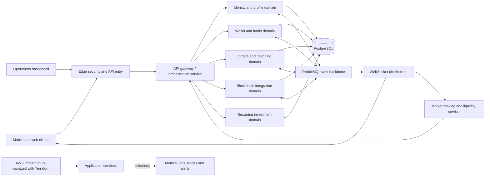

Digital Asset Exchange - Engineering Experience

> A sanitized engineering case study of a greenfield crypto exchange.
>
> This document intentionally excludes credentials, account identifiers, domains, network details, internal resource names, proprietary business rules, database schemas, message-routing details, deployment commands, and security-sensitive findings.

## Contents

- [Overview](#overview)
- [What I Built](#what-i-built)
- [High-Level Architecture](#high-level-architecture)
- [Platform Domains](#platform-domains)
- [Technology Stack](#technology-stack)
- [Key Engineering Challenges](#key-engineering-challenges)
- [Reliability Patterns Applied](#reliability-patterns-applied)
- [Validation Strategy](#validation-strategy)
- [My Responsibilities](#my-responsibilities)
- [What This Project Taught Me](#what-this-project-taught-me)
- [Confidentiality Note](#confidentiality-note)

## Overview

I designed and built a full-stack digital asset exchange platform spanning trading, wallet accounting, identity, real-time market data, blockchain integration, cloud infrastructure, observability, and operational tooling.

The project gave me hands-on experience with the engineering problems behind financial systems: exact decimal arithmetic, concurrent state changes, idempotency, event delivery, failure recovery, reconciliation, auditability, authentication, infrastructure automation, and production diagnostics.

This was not limited to writing REST APIs. My work covered the complete path from mobile and web clients to backend services, PostgreSQL and RabbitMQ, WebSocket fan-out, AWS infrastructure, Terraform, container delivery, monitoring, and failure-oriented test harnesses.

## What I Built

- A mobile and web trading experience for markets, order books, orders, wallets, deposits, withdrawals, identity, and account settings.
- A Java and Spring Boot microservice platform with clear domain ownership.
- An order-management and matching domain with durable recovery support.
- Wallet, balance, fund-lock, settlement, fee, and financial audit workflows.
- Event-driven communication through RabbitMQ with reliability controls.
- Real-time public and private updates through a native WebSocket protocol.
- User registration, authentication, MFA, KYC, session, and account-status flows.
- Cryptocurrency deposit and withdrawal integrations, including confirmation and reorganization-aware processing.
- A rule-based market-making service with reference-price and risk controls.
- A recurring investment/SIP domain designed around explicit state machines, idempotency, receipts, and reconciliation.
- An internal operations dashboard for support, monitoring, and controlled financial workflows.
- Reproducible AWS environments using Terraform, Docker, Packer, and automated deployment pipelines.
- Centralized metrics, logs, traces, dashboards, and alerting.
- Correctness, integration, chaos, recovery, and WebSocket capacity test harnesses.

## High-Level Architecture

The public diagram below is deliberately conceptual. It shows technology boundaries without exposing private topology or implementation details.

## Platform Domains

| Domain | Responsibility | Engineering focus |
| --- | --- | --- |
| Client applications | Mobile, web, and trading UX | React Native, Expo, React, TypeScript, secure local storage, state management, charts, WebSockets |
| API entry and orchestration | Client-facing API composition and downstream coordination | Validation, authentication, request identity, rate limiting, retries, circuit breakers, OpenAPI |
| Identity and profile | Signup, login, user state, KYC, MFA, sessions, notifications | OAuth 2.0/OIDC, JWT, AWS Cognito, TOTP, distributed workflows, scheduled recovery |
| Wallet and funds | Wallets, balances, locks, deposits, withdrawals, fees, settlement | PostgreSQL transactions, exact arithmetic, idempotency, audit trails, reconciliation |
| Orders and matching | Order lifecycle, matching, trades, market history | Concurrency, deterministic state transitions, durable recovery, snapshots, event publication |
| Blockchain integration | Address assignment, transaction tracking, confirmations, withdrawals | Bitcoin and Ethereum integration, duplicate detection, finality, reorganization handling |
| Real-time delivery | Public market data and private account updates | Native WebSockets, authentication, snapshots and deltas, sequencing, checksums, backpressure |
| Market making | Liquidity, quoting, inventory and risk controls | External price feeds, exact pricing, stale-data rejection, bounded actions, fail-closed behavior |
| Recurring investment | Scheduled investment plans and batch lifecycle | Explicit state machines, scheduler safety, idempotency, receipts, allocation and reconciliation |
| Operations | Administrative visibility and controlled workflows | React dashboard, service aggregation, analytics, role-aware operations, auditability |
| Platform engineering | Cloud, deployment, security and observability | AWS, Terraform, Docker, Packer, GitHub Actions, OpenTelemetry, Prometheus, Grafana |

## Technology Stack

### Languages and Engineering Formats

- Java, TypeScript, JavaScript, Python, Bash, SQL, and HCL
- YAML and JSON for application, infrastructure, monitoring, and deployment configuration
- Markdown, Mermaid, and OpenAPI for architecture, runbooks, and API contracts

### Backend

- Java 21
- Spring Boot 3
- Spring Web and Bean Validation
- Spring Data JPA and Hibernate
- Spring Security and OAuth 2.0 resource server
- Spring AMQP
- OpenFeign and client-side service discovery
- Resilience4j and Spring Retry
- Gradle
- Flyway database migrations
- OpenAPI / Swagger
- Structured JSON logging

### Data and Messaging

- PostgreSQL on Amazon RDS
- RabbitMQ / AMQP
- Redis and local Caffeine caching
- DynamoDB for selected cloud-managed state
- H2 for isolated local or simulation use cases
- Transactional outbox pattern
- Idempotent message consumers
- Publisher confirms
- Dead-letter and terminal parking flows
- Database constraints and immutable audit records

### Frontend and Mobile

- TypeScript
- React Native and Expo
- React and React Router
- Zustand state management
- TanStack Query
- Material UI
- Native and web charting libraries
- Secure storage and biometric authentication integrations
- Push notifications
- iOS, Android, and web environment-specific builds

### AWS and Cloud Platform

- Amazon EC2 and Auto Scaling Groups
- Amazon ECS where container orchestration was appropriate
- Amazon RDS for PostgreSQL
- Amazon EBS and S3
- Amazon ECR
- Amazon VPC, private networking, security groups, and load balancing
- Amazon API Gateway
- Amazon CloudFront for content delivery
- AWS Cloud Map service discovery
- AWS Cognito and Lambda authentication hooks
- AWS Systems Manager for configuration, secrets, and controlled deployment
- IAM roles and OIDC-based CI/CD access
- CloudWatch, CloudTrail, GuardDuty, and Security Hub
- EventBridge for scheduled operational automation
- SNS and SES integrations
- AWS Certificate Manager
- Cloudflare DNS, WAF, Zero Trust, Tunnel, and bot protection

### Infrastructure, Delivery, and Operations

- Terraform with reusable environment-aware modules
- Packer-built Amazon Linux golden images
- Docker and Docker Compose
- GitHub Actions
- Keyless AWS authentication through OIDC
- Immutable container images and versioned releases
- Health-gated instance bootstrap and deployment
- Separate local, staging, and production configuration
- Infrastructure and application rollback procedures

### Observability

- OpenTelemetry
- Prometheus
- Grafana
- Loki
- Tempo
- Alertmanager
- Node Exporter
- Custom blockchain metrics exporter
- Spring Boot Actuator and Micrometer-style application metrics
- Correlated structured logs and distributed traces

### Blockchain and External Integrations

- Self-hosted Bitcoin Core
- BitcoinJ
- Web3j
- Ethereum RPC and webhook providers
- Blockchain confirmation and reorganization monitoring
- External market-price and foreign-exchange feeds
- KYC provider integration
- Email, SMS, and mobile push integrations

### Testing and Quality

- JUnit 5 and Spring Boot Test
- Testcontainers for PostgreSQL and RabbitMQ integration tests
- WireMock for external-service contracts
- Awaitility for asynchronous behavior
- ArchUnit for architecture rules
- JaCoCo coverage reporting
- Jest and React Native Testing Library
- Node.js protocol and system harnesses
- Grafana k6 for WebSocket load testing
- Toxiproxy for latency, disconnect, restart, and backpressure scenarios
- Golden test vectors for financial arithmetic and protocol checksums

## Key Engineering Challenges

### 1. Preserving financial correctness across services

An exchange cannot treat a successful HTTP response as proof that a financial workflow completed correctly. Funds may be locked in one service, an order persisted in another, and settlement delivered asynchronously.

I addressed this with:

- explicit ownership of wallet, order, trade, and blockchain state;
- exact decimal and smallest-unit arithmetic instead of floating-point calculations;
- stable request and event identities;
- database-enforced uniqueness where replay could affect money;
- transactional outbox publication;
- idempotent consumers;
- immutable audit records; and
- reconciliation jobs that compare independently recorded facts.

The most important lesson was that retries are safe only when every side effect has a durable identity.

### 2. Coordinating PostgreSQL and RabbitMQ safely

Database commits and message publication do not share a transaction. A service can commit business state and fail before publishing its event, or publish a message that a consumer receives more than once.

I used the transactional outbox pattern to record events with business changes, publisher confirms to establish broker acceptance, and consumer-side processed-message records for replay safety. Dead-letter handling, bounded retry policy, and terminal parking paths make malformed events observable without allowing endless retry loops.

### 3. Recovering the trading path after failure

The trading path requires stronger recovery behavior than a standard CRUD service. I worked on durable recovery records, write-ahead logging, snapshots, startup restoration, and critical handoff checks so that accepted work can be recovered or reconciled after process interruption.

Recovery tests intentionally restart or pause services and then verify orders, trades, locks, balances, fees, outbox state, and message-queue quietness against an independent model.

### 4. Building correct real-time market data

Real-time delivery involved more than opening a socket. Clients need a coherent initial order book, ordered deltas, freshness signals, authentication for private channels, and a safe way to detect missed or corrupted updates.

The protocol uses versioned envelopes, full snapshots, ordered deltas, stream generations, sequence validation, and checksums. Client-side decimal validation prevents platform-specific number parsing from silently changing an order book. The server includes bounded queues and backpressure controls so slow clients cannot consume unlimited memory.

An isolated capacity qualification successfully opened and held 25,000 concurrent public WebSocket connections, then closed them cleanly with zero connection errors in the accepted run. Correctness, authentication, restart, slow-consumer, and private-channel isolation were tested separately because a capacity test alone cannot prove protocol correctness.

### 5. Handling blockchain finality

Blockchain events are duplicated, delayed, and occasionally reorganized. A webhook therefore cannot directly mean “credit the wallet.”

I separated observation, confirmation, canonical transaction identity, finality, credit, and reconciliation. Duplicate notifications resolve to the same durable identity, while confirmation and reorganization handling prevent an early observation from becoming an irreversible duplicate credit.

### 6. Designing security in layers

The platform combines edge filtering, private networking, least-privilege service access, managed identity, MFA, KYC, encrypted storage, controlled secrets, and audit logging.

Application services validate JWTs and permissions at their trust boundaries. Infrastructure uses role-based AWS access, short-lived CI/CD credentials through OIDC, encrypted data stores, and centralized configuration rather than credentials embedded in code or images.

### 7. Making infrastructure reproducible

I modeled networking, compute, databases, storage, identity, service discovery, monitoring, and edge integrations as Terraform modules with separate environment configuration.

Packer produces a thin golden AMI with common runtime tooling and a bootstrap agent. Application code stays in versioned container images, allowing the same base image to run different services while preserving repeatable provisioning and health-gated startup.

### 8. Treating observability as part of correctness

Metrics and logs were designed around business transitions as well as CPU and memory. The platform records settlement, outbox, consumer, reconciliation, queue, WebSocket, JVM, database, host, and blockchain health signals.

OpenTelemetry provides cross-service context; Prometheus and Grafana expose operational state; Loki centralizes structured logs; Tempo supports trace analysis; and Alertmanager routes actionable failures.

## Reliability Patterns Applied

| Problem | Pattern used |
| --- | --- |
| Duplicate client request | Idempotency key and durable request identity |
| Database commit followed by publication failure | Transactional outbox |
| Duplicate or redelivered message | Idempotent consumer and uniqueness constraint |
| Temporary downstream failure | Bounded retry with backoff and circuit breaker |
| Permanently invalid event | Dead-letter handling and terminal parking |
| Concurrent balance update | Transaction boundary, locking strategy, and invariant checks |
| Process interruption during trading | Durable recovery log, snapshots, and startup reconciliation |
| Missed real-time update | Sequence detection followed by full snapshot recovery |
| Slow WebSocket consumer | Bounded buffering, timeout, and controlled disconnect |
| Duplicate blockchain notification | Canonical transfer identity and replay-safe processing |
| Blockchain reorganization | Confirmation/finality state and reconciliation |
| Scheduler overlap | Durable locks and idempotent state transitions |
| Partial distributed workflow | Compensating action and repair workflow |
| Deployment failure | Health gate, immutable image, automated rollback/replacement |

## Validation Strategy

I used multiple layers of validation because no single test type is sufficient for a financial platform:

1. Unit tests for arithmetic, validation, state transitions, and protocol rules.
2. Repository and service integration tests against real PostgreSQL and RabbitMQ containers.
3. Contract tests for REST and external-provider boundaries.
4. Architecture tests to prevent unwanted dependencies between layers.
5. Cross-service correctness tests driven by an independent settlement oracle.
6. Replay and duplicate-delivery tests for idempotency.
7. Restart, disconnect, latency, and backpressure tests using controlled fault injection.
8. Reconciliation checks across orders, trades, locks, wallets, fees, events, and recovery records.
9. WebSocket protocol tests for authentication, subscription isolation, sequence, checksums, heartbeats, and recovery.
10. Capacity tests that are kept separate from correctness claims.

## My Responsibilities

My work across this project included:

- translating exchange and wallet requirements into bounded service domains;
- designing REST, event, and WebSocket contracts;
- implementing Java/Spring Boot services and TypeScript clients;
- modeling PostgreSQL schemas and Flyway migrations;
- designing RabbitMQ exchanges, queues, retry behavior, and consumer safety;
- implementing order, settlement, wallet, identity, blockchain, and market-data workflows;
- building AWS infrastructure through Terraform;
- containerizing services and designing CI/CD and runtime bootstrap flows;
- implementing metrics, logs, traces, dashboards, and alerts;
- writing failure-mode analyses, runbooks, and reconciliation procedures; and
- building automated correctness and load-testing tools.

## What This Project Taught Me

- Financial correctness comes from explicit invariants, not from optimistic happy-path code.
- “Exactly once” is normally an end-to-end business property built from durable identity and idempotency, not a broker setting.
- A real-time system must define ordering, resynchronization, backpressure, and freshness—not only transport.
- Recovery must be designed before failure occurs and verified against durable facts afterward.
- Database constraints are an essential final line of defense for money-moving systems.
- Reconciliation is a product capability, not only an operations task.
- Infrastructure automation is most valuable when security, observability, and rollback are part of the module design.
- Load-test evidence is credible only when the workload, thresholds, build identity, failures, and cleanup are recorded.
- Fail-closed behavior is appropriate when authentication, market data, pricing, or financial state is uncertain.

### Summary:

- Engineered an event-driven digital asset exchange across Java 21/Spring Boot microservices, PostgreSQL, RabbitMQ, React Native, and AWS.
- Designed replay-safe financial workflows using idempotency keys, transactional outbox, publisher confirms, database constraints, audit trails, and reconciliation.
- Built order-management, wallet settlement, identity/KYC, blockchain, WebSocket market-data, liquidity, and recurring-investment capabilities.
- Provisioned reproducible multi-environment AWS infrastructure with Terraform, Docker, Packer, EC2, RDS, ECR, S3, Cognito, Lambda, and service discovery.
- Implemented end-to-end observability with OpenTelemetry, Prometheus, Grafana, Loki, Tempo, and Alertmanager.
- Developed correctness, recovery, chaos, and load harnesses using Testcontainers, k6, Toxiproxy, golden test vectors, and independent financial reconciliation.
- Qualified an isolated native WebSocket workload at 25,000 concurrent connections with zero connection errors in the accepted run.

## Confidentiality Note

This case study describes transferable engineering experience only. It deliberately omits confidential source code, proprietary algorithms, private architecture details, credentials, customer or financial data, internal names, live endpoints, exact cloud topology, operational thresholds, and unresolved security findings. Deeper implementation details can be discussed in an interview at an appropriate level and subject to confidentiality obligations.
